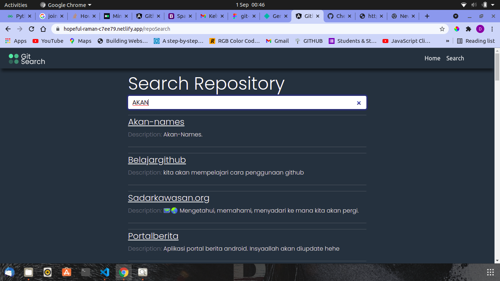

# Git Search
This is a web app that enables a user to search from Github for users using their usernames and repositories using their names
#### By Cheboi Derrick
## Description
This is an application where users can search github repositories.
The user should also be able to:
- Search Github username
- Search Github repositories and see repo names and description

## Screenshots
- Landing Page
    
- Search user 
    
- Search repository
    

## Setup and Installation Requirements
* Copy the repo [link](https://github.com/CheboiDerrick/github_search)
* Clone on your computer
* Run the following commands on your command line
    - ``npm install``
    - `ng serve`
* Open the app to the on your preferred browser `http://localhost:4200`

You need to have an angular environment set up on your end device

## Known Bugs
There are no known bugs so far.

## Technologies Used
The website has been developed using the following:
- Angular 12.2.0
- Bootstrap
- You can also live view the website [here](https://gitsearchcheboi.netlify.app/)

## Support and contact details
Feel free to give suggestions or bugs and possible suggestions through:
- *derrickchb@gmail.com*
### License
[MIT](https://github.com/CheboiDerrick/github_search/blob/main/LICENSE)
Copyright (c) 2021

